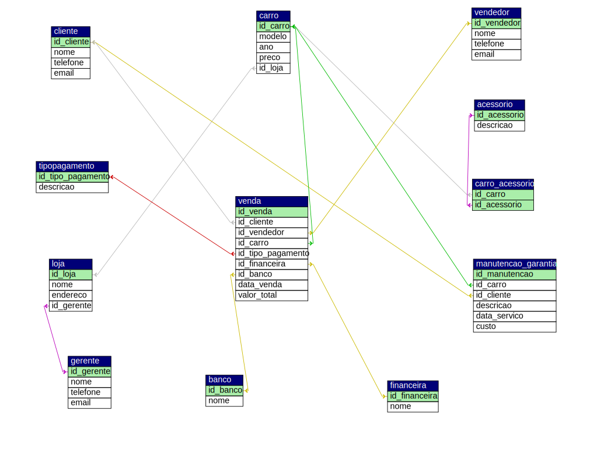

# 🚗 AutoManager Pro: Sistema de Gestão de Concessionárias

Este projeto evoluiu de uma modelagem de banco de dados para uma **aplicação web completa**, permitindo o gerenciamento em tempo real de estoque, fotos de veículos e fluxo de vendas.

## 📊 Arquitetura de Dados
O sistema utiliza uma estrutura relacional sólida para garantir a integridade entre Marcas, Modelos, Lojas e Vendas.

## 🚀 Funcionalidades Implementadas
- **Dashboard Gerencial:** Visualização de faturamento total e volume de vendas.
- **Gestão de Fotos:** Upload de imagens personalizadas com tratamento de nomes únicos (MD5).
- **CRUD Completo:** Cadastro, edição e exclusão de veículos e modelos.
- **Fluxo de Venda:** Processamento de vendas com histórico automatizado.
- **Relatórios:** Histórico de transações detalhado por loja e período.

## 🛠️ Tecnologias
- **Backend:** PHP 8.x
- **Banco de Dados:** MySQL / MariaDB
- **Frontend:** Bootstrap 5 & Bootstrap Icons
- **Modelagem:** phpMyAdmin Designer & dbdiagram.io

## 📁 Estrutura do Projeto
- `/uploads`: Armazenamento de imagens dos veículos.
- `/database`: Contém o arquivo `database.sql` para replicação do ambiente.
- `index.php`: Dashboard principal.
- `relatorio_vendas.php`: Módulo de histórico financeiro.

##  🔗 Acesse o projeto online:
http://awaldige.infinityfree.me/vendascarros/

## 📸 Prévia

## ⚙️ Como Instalar e Rodar
1. Clone este repositório em seu servidor local (ex: `/htdocs` do XAMPP).
2. Importe o arquivo `database.sql` no seu MySQL.
3. Configure as credenciais de acesso no arquivo `conexao.php`.
4. Certifique-se de que a pasta `uploads/` possua permissões de escrita (CHMOD 777 em sistemas Linux).

---
*Projeto desenvolvido para fins de portfólio técnico - Full Stack (PHP/SQL).*
